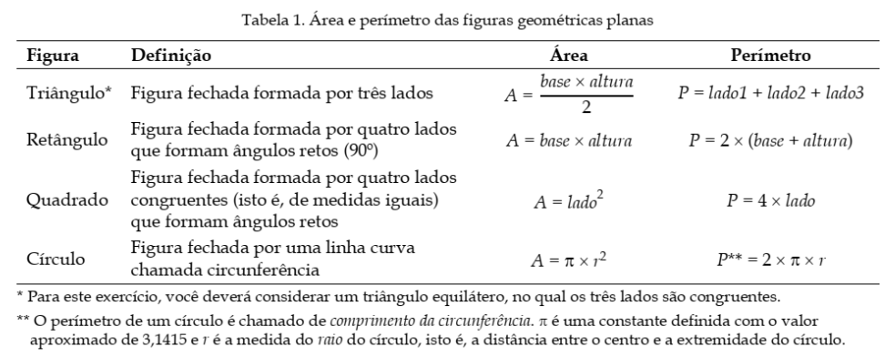
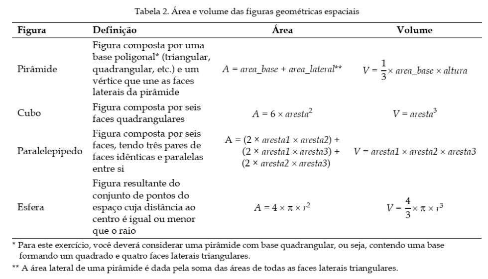

# Laboratório 1 da disciplina Linguagem de programação 2023.2

A Geometria é fundamental para resolver problemas em agricultura, astronomia, arquitetura e engenharia. Dentre as divisões da Geometria, encontram-se as chamadas Geometria Plana e Geometria Espacial. A Geometria Plana refere-se ao estudo das figuras geométricas definidas em um plano de duas dimensões, enquanto que a Geometria Espacial se encarrega do estudo das figuras geométricas (também chamadas de sólidos geométricos) definidas no espaço, ou seja, aquelas que possuem mais de duas dimensões e ocupam um lugar no espaço. As principais figuras geométricas planas são o triângulo, o quadrado, o retângulo e o círculo. Já as principais figuras geométricas espaciais são o cubo, a esfera, o cone, a pirâmide, o paralelepípedo e o cilindro.

Três conceitos são de suma importância para o entendimento das Geometrias Plana e Espacial, a saber, a área, o perímetro e o volume. A área de uma figura geométrica, seja ela plana ou espacial, expressa o tamanho de tal figura sobre uma superfície, de modo que quanto maior a superfície da figura, maior a sua área. O perímetro de uma figura geométrica é definido como a medida do contorno que delimita a figura, sendo resultante da soma das medidas de todos os seus lados. Por fim, o volume corresponde à medida do espaço ocupado por uma figura geométrica. Para encontrar os valores dessas medidas, é importante analisar o tipo da figura (se plana ou espacial) e a forma da figura, isto é, quantos e quais são os lados.

**Área, perímetro e volume de figuras geométricas planas e espaciais**

As Tabelas 1 e 2 apresentam a definição das principais figuras geométricas planas e espaciais, bem como as fórmulas utilizadas para calcular as medidas de área, perímetro e volume. É importante notar que, pelo fato de as figuras geométricas planas serem definidas em um plano de duas dimensões, elas não possuem volume.

+ para a pirâmide, considere que a entrada do programa é o valor de um dos lados da base e a altura de um dos triangulos da face lateral.

# Projeto

Utilizando C++ foi possível desenvolver um algoritmo modularizado para cada figura geometrica em que seja possível definir uma entrada para cada um de forma que a saída seja os resultados de área, perímetro e volume.
